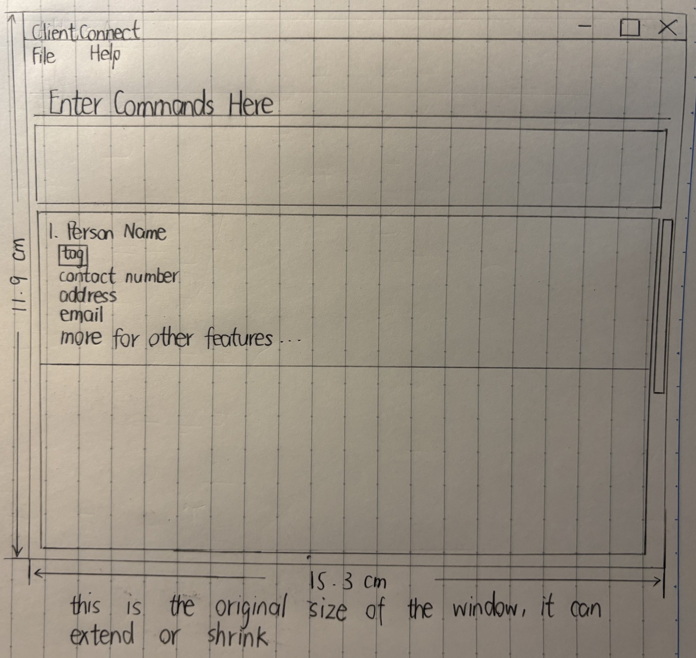

ClientConnect is a desktop app for providing fast access to clients’ addresses and preferences to help salespeople in making sales decisions and building rapports with clients, which can potentially increase their sales revenue.

* For the detailed documentation of this project, see the **[ClientConnect Product Website](https://ay2425s2-cs2103t-w13-2.github.io/tp/)**.
