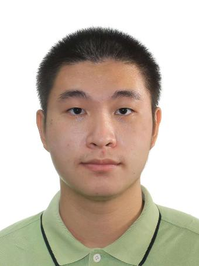
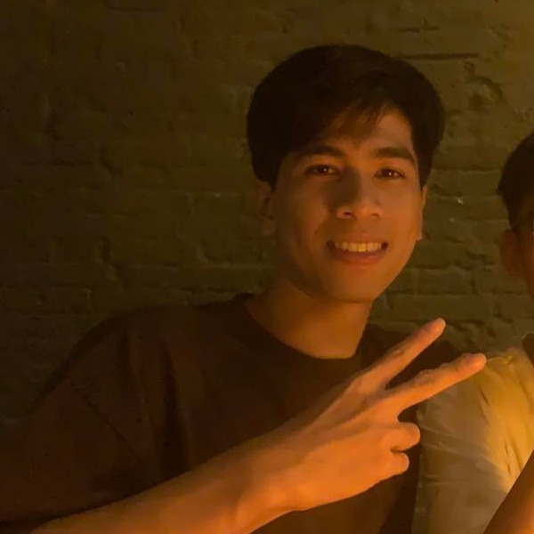

# About Us

We are a team based in the [School of Computing, National University of Singapore](http://www.comp.nus.edu.sg).

You can reach us at the email `seer[at]comp.nus.edu.sg`

## Project team

### John Doe

[[homepage](http://www.comp.nus.edu.sg/~damithch)]
[[github](https://github.com/johndoe)]
[[portfolio](team/sherrinfordhr)]

* Role: Project Advisor

### Dingwei

[[github](http://github.com/SherrinfordHR)]
[[portfolio](team/sherrinfordhr.md)]

* Role: Developer
* Responsibilities: Develop ops
* Y2, Computer Science,  love anime, gaming and novel

### Johnny Doe

[[github](http://github.com/johndoe)] [[portfolio](team/sherrinfordhr)]

* Role: Developer
* Responsibilities: Data

### Jean Doe

[[github](http://github.com/johndoe)]
[[portfolio](team/sherrinfordhr)]

* Role: Developer
* Responsibilities: Dev Ops + Threading

### Nguyen Le Quoc Hung

[[github](http://github.com/nlqhung130403)]
[[portfolio](team/nlqhung130403.md)]

* Role: Developer
* Responsibilities: UI
