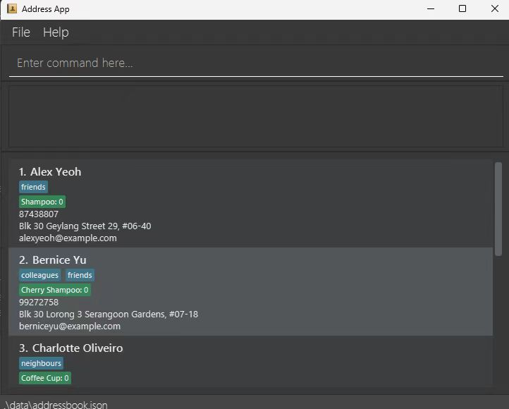
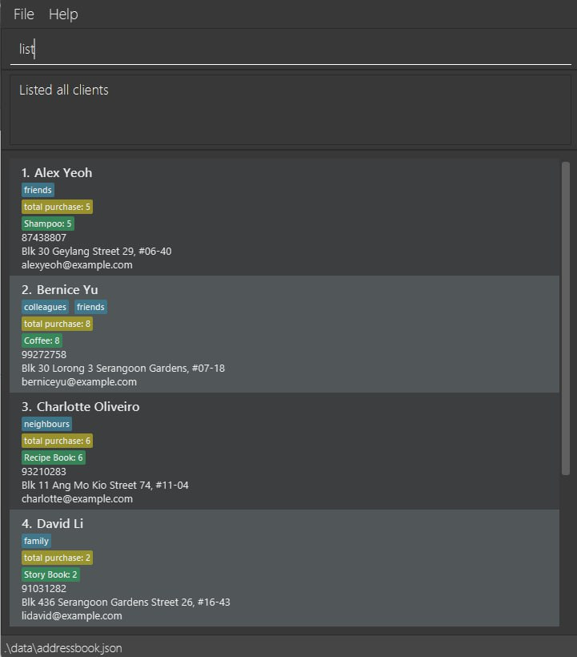
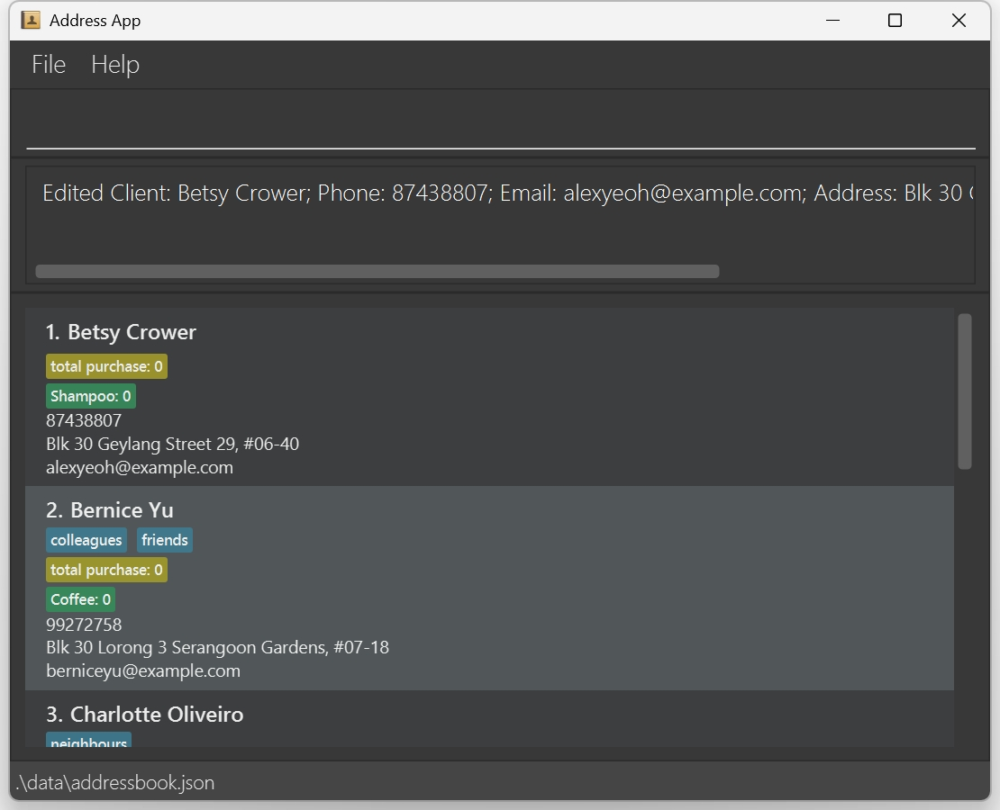
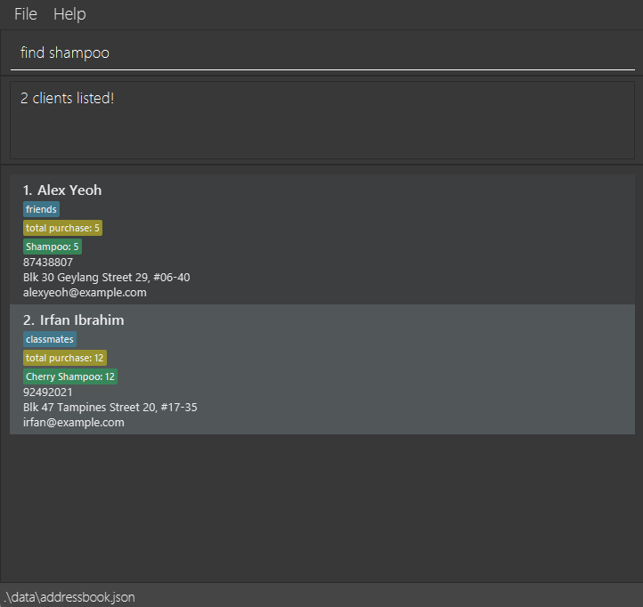
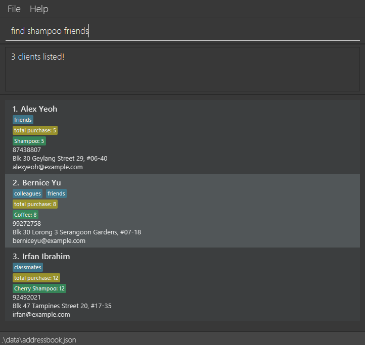
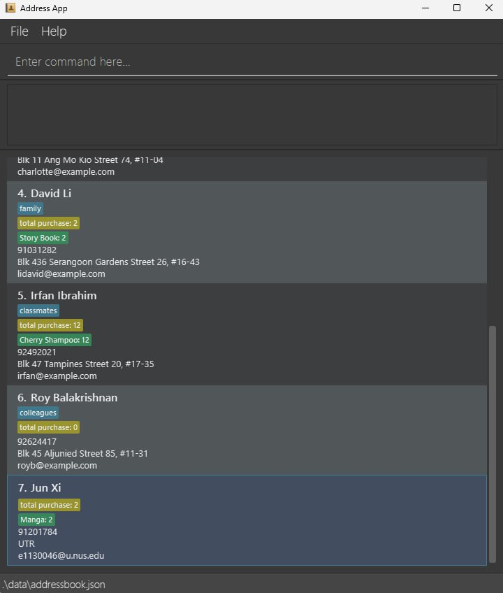
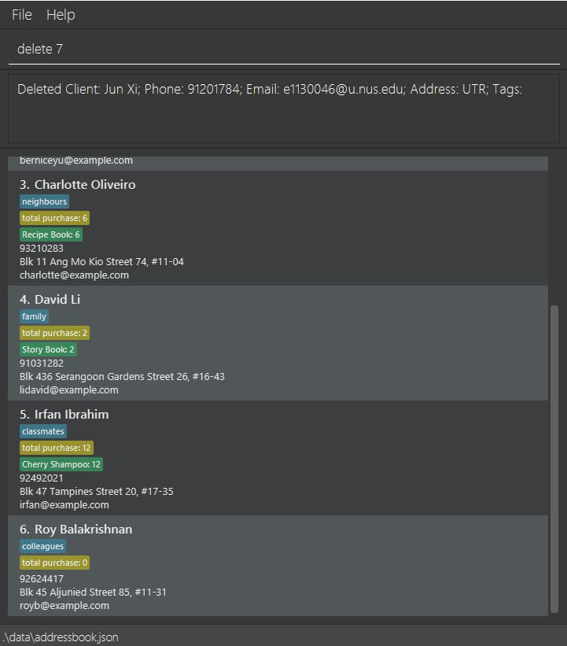
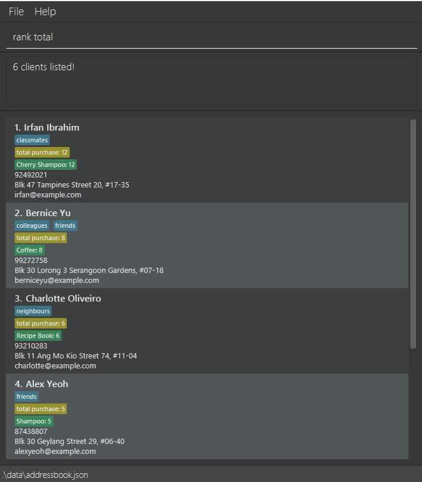
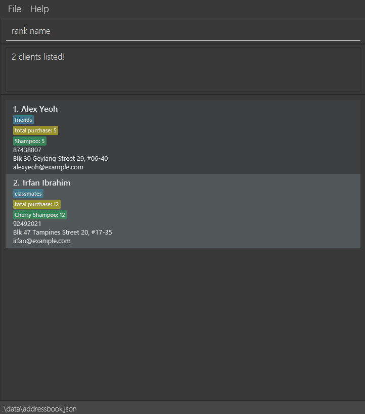
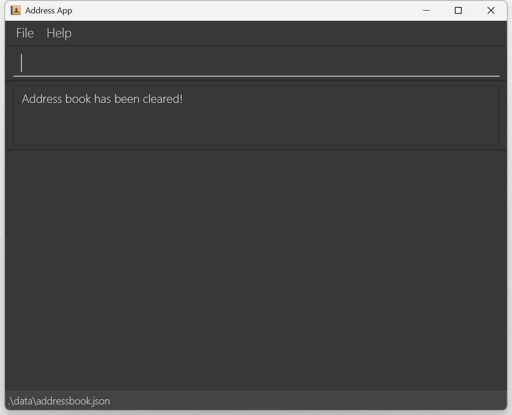

# ClientConnect User Guide

ClientConnect is a **desktop app for managing contacts, optimized for use via a  Line Interface** (CLI) while still having the benefits of a Graphical User Interface (GUI). If you can type fast, AB3 can get your contact management tasks done faster than traditional GUI apps.

<!-- * Table of Contents -->
<page-nav-print />

--------------------------------------------------------------------------------------------------------------------

## Quick start

1. Ensure you have Java `17` or above installed in your Computer.<br>
   **Mac users:** Ensure you have the precise JDK version prescribed [here](https://se-education.org/guides/tutorials/javaInstallationMac.html).

1. Download the latest `.jar` file from [here](https://github.com/se-edu/addressbook-level3/releases).

1. Copy the file to the folder you want to use as the _home folder_ for your AddressBook.

1. Open a command terminal, `cd` into the folder you put the jar file in, and use the `java -jar addressbook.jar` command to run the application.<br>
   A GUI similar to the below should appear in a few seconds. Note how the app contains some sample data.<br>
   

1. Type the command in the command box and press Enter to execute it. e.g. typing **`help`** and pressing Enter will open the help window.<br>
   Some example commands you can try:

   * `list` : Lists all contacts.

   * `add n/John Doe p/98765432 e/johnd@example.com a/John street, block 123, #01-01` : Adds a contact named `John Doe` to the Address Book.

   * `delete 3` : Deletes the 3rd contact shown in the current list.

   * `clear` : Deletes all contacts.

   * `exit` : Exits the app.

   * `find friends` : Finds all contacts that has the word `friends` in either of their names, tags, or product preferences.

   * `rank name` : Ranks the contacts based on the clients' names.

1. Refer to the [Features](#features) below for details of each command.

--------------------------------------------------------------------------------------------------------------------

## Features

<box type="info" seamless>

**Notes about the command format:**<br>

* Words in `UPPER_CASE` are the parameters to be supplied by the user.<br>
  e.g. in `add n/NAME`, `NAME` is a parameter which can be used as `add n/John Doe`.

* Items in square brackets are optional.<br>
  e.g `n/NAME [t/TAG]` can be used as `n/John Doe t/friend` or as `n/John Doe`.

* Items with `…`​ after them can be used multiple times including zero times.<br>
  e.g. `[t/TAG]…​` can be used as ` ` (i.e. 0 times), `t/friend`, `t/friend t/family` etc.

* Parameters can be in any order.<br>
  e.g. if the command specifies `n/NAME p/PHONE_NUMBER`, `p/PHONE_NUMBER n/NAME` is also acceptable.

* Extraneous parameters for commands that do not take in parameters (such as `help`, `list`, `exit` and `clear`) will be ignored.<br>
  e.g. if the command specifies `help 123`, it will be interpreted as `help`.

* If you are using a PDF version of this document, be careful when copying and pasting commands that span multiple lines as space characters surrounding line-breaks may be omitted when copied over to the application.
</box>

### Viewing help : `help`

You may feel stuck after using ClientConnect for a while. To review how it's used, you can show a message explaining how to access the help page.


Just typing the following and you will get your help in no time:
```
help
```


### Adding a client: `add`

Adds a client to the address book.

Format: `add n/NAME p/PHONE_NUMBER e/EMAIL a/ADDRESS [t/TAG]…​`

<box type="tip" seamless>

**Tip:** A client can have any number of tags (including 0)
</box>

Examples:
* `add n/John Doe p/98765432 e/johnd@example.com a/John street, block 123, #01-01`
* `add n/Betsy Crowe t/friend e/betsycrowe@example.com a/Newgate Prison p/1234567 t/criminal`

### Listing all clients : `list`

Ready to see all your amazing contacts? Just type:

```
list
```

* This command will display a complete list of every client in your address book, so you can easily check out all your contacts at a glance. Enjoy the view!


### Editing a client : `edit`

Ready to update a client’s details? With the `edit` command, you can easily change information like name, phone number, 
email, address, tags, and product preferences! Just follow this format:

```
edit INDEX [name/NAME] [phone/PHONE] [email/EMAIL] [address/ADDRESS] [tag/TAG] [pref/PRODUCT PREFERENCE] [freq/PRODUCT FREQUENCY]…​`
```

Here's how it works:
* **Select Your Client:** Replace **INDEX** with the client’s number from your current list.
> Remember, it must be a positive integer.
* **Update Your Info:** Add one or more optional fields to update specific details. At least one field must be provided.
* **Automatic Replacement:** Each field you specify will replace the existing value. For tags, the old ones are completely removed—unless you leave them out.
* **Clear Tags:** To remove all tags, simply type `tag/` without any tags following it.
* **Product Preferences:** When updating product preferences, include both `pref/` and `freq/` together. 
If you only provide `pref/`, the frequency defaults to 0.
> Using only `freq/` without `pref/` isn’t allowed.

Examples:
*  **Update Contact Info:**
   Type `edit 1 phone/91234567 email/johndoe@example.com` to instantly change the phone number and email of the 1st client to 91234567 and johndoe@example.com.
*  **Rename and Reset Tags:**
   Type `edit 1 name/Betsy Crower tag/` to update the 1st client’s name to Betsy Crower while clearing all their tags.
   <br>
   

### Locating clients: `find`

You can find clients whose names contain any of the given keywords. You'll have access to certain clients who are tagged specifically or had purchased a certain product from you.

You may use the following format for searching:<br>
```
find KEYWORD [MORE_KEYWORDS]
```

* The search ignores letter case. For example, `hans` will match `Hans`
* The order of the keywords does not matter as well. It does not matter whether you search for `Hans Bo` or `Bo Hans`, they are the same.
* Only full words will be matched e.g. `Han` will not match `Hans`
* Clients matching at least one keyword will be returned (i.e. `OR` search).
  e.g. `Hans Bo` will return `Hans Gruber`, `Bo Yang`
* Name, product preference and tags can be searched.
* As such, you may use combinations of words from the different attributes to search for multiple clients with mix attributes.
 e.g. `shampoo friends` will return all matching clients with the `friend` tag or `shampoo` product preference.
 

Examples:
* `find John` returns `john` and `John Doe`
* `find alex david` returns `Alex Yeoh`, `David Li`<br>
  

* `find shampoo` returns `Shampoo` and `Cherry Shampoo` in the product preference.<br>
  

* `find classmates` returns `classmates` in the tag<br>
  

* `find shampoo friends` returns `friends` in the tags and/ or `shampoo` in the product preference.<br>
  

### Deleting a client : `delete`

You can remove a client from your address book using the **delete** command. To do so, type:

```
expand INDEX
```

* Replace **INDEX** with the number corresponding to the client in your current list 
* For example, 1 for the first client, 2 for the second, etc.
> Remember, the INDEX must be a **positive integer** 1, 2, 3, …​

Examples:
* After using the `find Betsy` command, typing `delete 1` will remove the 1st client from the search results.
* If you run the `list` command, then typing `delete 7` will remove the 7th client from your address book.<br>
  <br>
  

### Expand Client View: `expand`

You can use the **expand** command to see more details about a specific client. Just type:

```
expand INDEX
```

* where INDEX is the position number of the client in your current list. 
* for example, 1 for the first client, 2 for the second, and so on
> The INDEX must be a **positive integer** 1, 2, 3, …​

Examples:
* After running the `list` command, typing `expand 2` will show more details for the second client.
* If you search with `find Joe`, then typing `expand 1` will display the details for the first client in your search results.<br>


### Ranking clients : `rank`

After a lot of searching and listing, you may want to find out clients that have higher priority than others. In ClientConnect, ranking is possible to sort the current list of clients shown on the screen.

Type in the following format, using the keyword that you would like to rank your clients by:<br>
```
rank KEYWORD
```

> ❗ **NOTE**<br>
> * The keyword must be one of the defined keywords.
> * Some examples of `KEYWORD`:
>   * `total` to rank by the clients' total purchase in descending order.
>   * `name` to rank by the clients' names in lexicographic order (i.e. ascending order alphabetically and numerically).

* Ranks the current list of clients by the specified `KEYWORD`.
* The keyword refers to the attribute or factor you may rank the clients by.
* The sorting would work regardless of letter case. For instance, `Name` and `name` would be ranked the same way.

Examples:
* `list` (automatically ranks by name) followed by `rank total` ranks all clients by their total purchase.<br>
  

* `find shampoo` followed by `rank name` ranks all clients that are found by the `find` command by their names in lexicographical order.<br>
  


### Clearing all entries : `clear`

To remove every client from your address book at once, just type:

```
clear
```

This command will instantly wipe all entries for you.<br>


### Exiting the program : `exit`

When you're ready to close the application, simply type:

```
exit
```
You can move on to your day feeling prepared.

### Saving the data

AddressBook data are saved in the hard disk automatically after any command that changes the data. There is no need to save manually.

### Editing the data file

AddressBook data are saved automatically as a JSON file `[JAR file location]/data/addressbook.json`. Advanced users are welcome to update data directly by editing that data file.

<box type="warning" seamless>

**Caution:**
If your changes to the data file makes its format invalid, AddressBook will discard all data and start with an empty data file at the next run.  Hence, it is recommended to take a backup of the file before editing it.<br>
Furthermore, certain edits can cause the AddressBook to behave in unexpected ways (e.g., if a value entered is outside the acceptable range). Therefore, edit the data file only if you are confident that you can update it correctly.
</box>

### Archiving data files `[coming in v2.0]`

_Details coming soon ..._

--------------------------------------------------------------------------------------------------------------------

## FAQ

**Q**: How do I transfer my data to another Computer?<br>
**A**: Install the app in the other computer and overwrite the empty data file it creates with the file that contains the data of your previous AddressBook home folder.

--------------------------------------------------------------------------------------------------------------------

## Known issues

1. **When using multiple screens**, if you move the application to a secondary screen, and later switch to using only the primary screen, the GUI will open off-screen. The remedy is to delete the `preferences.json` file created by the application before running the application again.
2. **If you minimize the Help Window** and then run the `help` command (or use the `Help` menu, or the keyboard shortcut `F1`) again, the original Help Window will remain minimized, and no new Help Window will appear. The remedy is to manually restore the minimized Help Window.

--------------------------------------------------------------------------------------------------------------------

## Command summary

Action     | Format, Examples
-----------|----------------------------------------------------------------------------------------------------------------------------------------------------------------------
**Add**    | `add name/NAME phone/PHONE_NUMBER email/EMAIL address/ADDRESS [tag/TAG] [pref/PRRODUCT_PREFERENCE] [freq/PRODUCT_FREQUENCY]…​` <br> e.g., `add name/James Ho phone/22224444 email/jamesho@example.com address/123, Clementi Rd, 1234665 tag/friend tag/colleague pref/Shampoo freq/10`
**Clear**  | `clear`
**Delete** | `delete INDEX`<br> e.g., `delete 3`
**Edit**   | `edit INDEX [name/NAME] [phone/PHONE_NUMBER] [email/EMAIL] [address/ADDRESS] [tag/TAG] [pref/PRODUCT_PREFERENCE] [freq/PRODUCT_FREQUENCY]…​`<br> e.g.,`edit 2 name/James Lee email/jameslee@example.com`
**Find**   | `find KEYWORD [MORE_KEYWORDS]`<br> e.g., `find James Jake`
**List**   | `list`
**Help**   | `help`
**Rank**   | `rank KEYWORD` <br> e.g., `rank total` `rank name`
**Expand** | `expand INDEX` <br> e.g., `expand 1`
